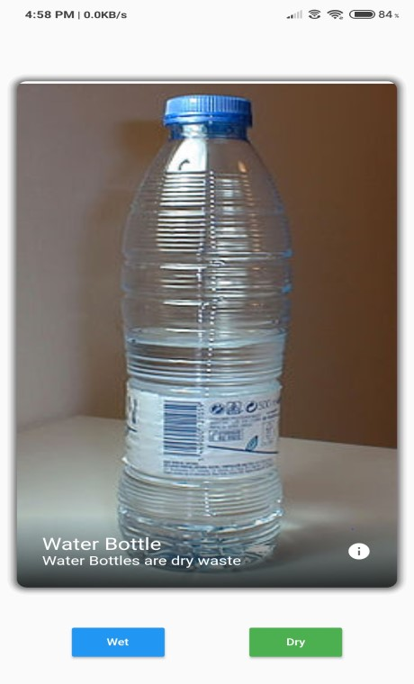

# Learn

Our app enables special childrens with down syndrome to learn classifying wet and dry waste by looking at the images. The app teaches and tells using text to speech weather the choice made by the individual is right or not .
